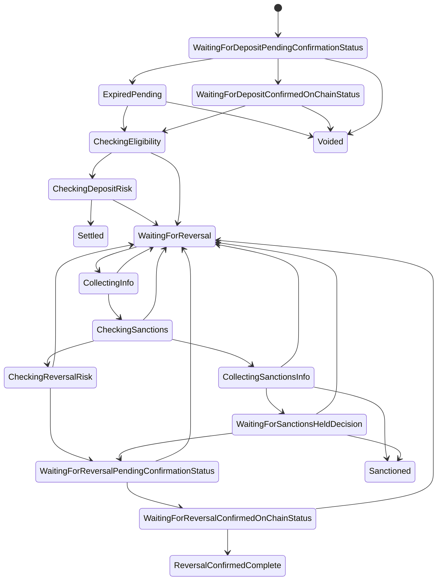

```mermaid
stateDiagram-v2
    [*] --> WaitingForDepositPendingConfirmationStatus
    CheckingDepositRisk --> Settled
    CheckingDepositRisk --> WaitingForReversal
    CheckingEligibility --> CheckingDepositRisk
    CheckingEligibility --> WaitingForReversal
    CheckingReversalRisk --> WaitingForReversal
    CheckingReversalRisk --> WaitingForReversalPendingConfirmationStatus
    CheckingSanctions --> CheckingReversalRisk
    CheckingSanctions --> CollectingSanctionsInfo
    CheckingSanctions --> WaitingForReversal
    CollectingInfo --> CheckingSanctions
    CollectingInfo --> WaitingForReversal
    CollectingSanctionsInfo --> Sanctioned
    CollectingSanctionsInfo --> WaitingForReversal
    CollectingSanctionsInfo --> WaitingForSanctionsHeldDecision
    ExpiredPending --> CheckingEligibility
    ExpiredPending --> Voided
    WaitingForDepositConfirmedOnChainStatus --> CheckingEligibility
    WaitingForDepositConfirmedOnChainStatus --> Voided
    WaitingForDepositPendingConfirmationStatus --> ExpiredPending
    WaitingForDepositPendingConfirmationStatus --> Voided
    WaitingForDepositPendingConfirmationStatus --> WaitingForDepositConfirmedOnChainStatus
    WaitingForReversal --> CollectingInfo
    WaitingForReversalConfirmedOnChainStatus --> ReversalConfirmedComplete
    WaitingForReversalConfirmedOnChainStatus --> WaitingForReversal
    WaitingForReversalPendingConfirmationStatus --> WaitingForReversal
    WaitingForReversalPendingConfirmationStatus --> WaitingForReversalConfirmedOnChainStatus
    WaitingForSanctionsHeldDecision --> Sanctioned
    WaitingForSanctionsHeldDecision --> WaitingForReversal
    WaitingForSanctionsHeldDecision --> WaitingForReversalPendingConfirmationStatus
```