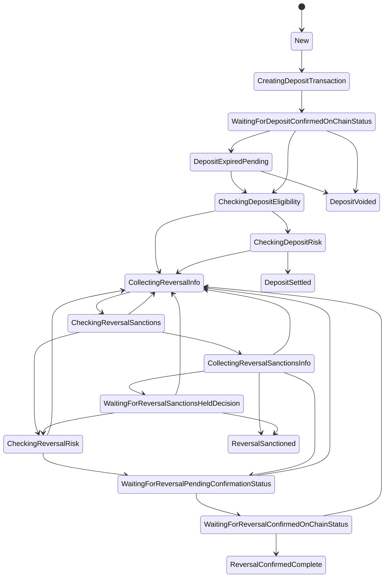

```mermaid
stateDiagram-v2
[*] --> New
CheckingDepositEligibility --> CheckingDepositRisk
CheckingDepositEligibility --> CollectingReversalInfo
CheckingDepositRisk --> CollectingReversalInfo
CheckingDepositRisk --> DepositSettled
CheckingReversalRisk --> CollectingReversalInfo
CheckingReversalRisk --> WaitingForReversalPendingConfirmationStatus
CheckingReversalSanctions --> CheckingReversalRisk
CheckingReversalSanctions --> CollectingReversalInfo
CheckingReversalSanctions --> CollectingReversalSanctionsInfo
CollectingReversalInfo --> CheckingReversalSanctions
CollectingReversalSanctionsInfo --> CollectingReversalInfo
CollectingReversalSanctionsInfo --> ReversalSanctioned
CollectingReversalSanctionsInfo --> WaitingForReversalPendingConfirmationStatus
CollectingReversalSanctionsInfo --> WaitingForReversalSanctionsHeldDecision
CreatingDepositTransaction --> WaitingForDepositConfirmedOnChainStatus
DepositExpiredPending --> CheckingDepositEligibility
DepositExpiredPending --> DepositVoided
New --> CreatingDepositTransaction
WaitingForDepositConfirmedOnChainStatus --> CheckingDepositEligibility
WaitingForDepositConfirmedOnChainStatus --> DepositExpiredPending
WaitingForDepositConfirmedOnChainStatus --> DepositVoided
WaitingForReversalConfirmedOnChainStatus --> CollectingReversalInfo
WaitingForReversalConfirmedOnChainStatus --> ReversalConfirmedComplete
WaitingForReversalPendingConfirmationStatus --> CollectingReversalInfo
WaitingForReversalPendingConfirmationStatus --> WaitingForReversalConfirmedOnChainStatus
WaitingForReversalSanctionsHeldDecision --> CheckingReversalRisk
WaitingForReversalSanctionsHeldDecision --> CollectingReversalInfo
WaitingForReversalSanctionsHeldDecision --> ReversalSanctioned
```